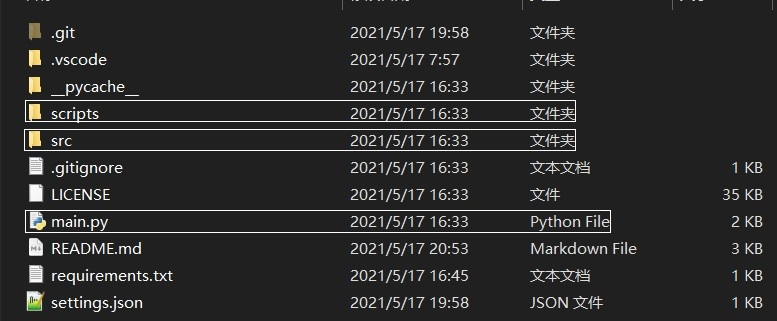
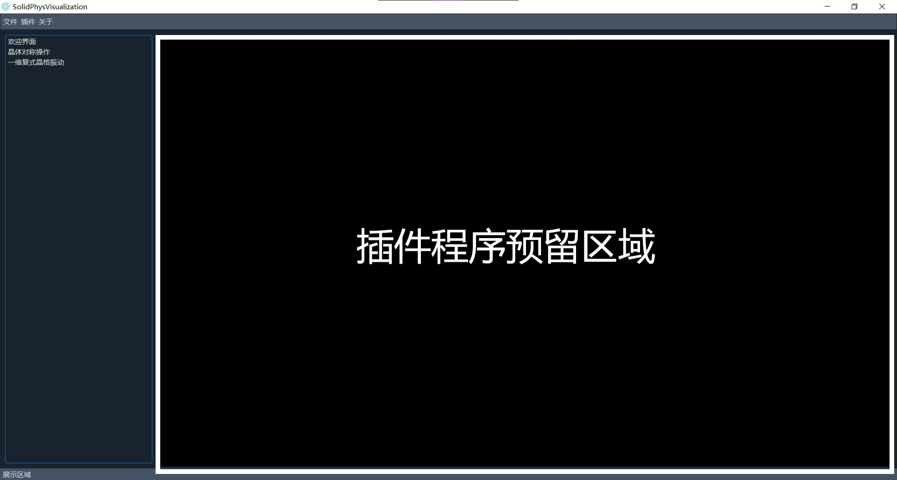
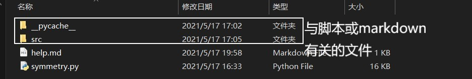
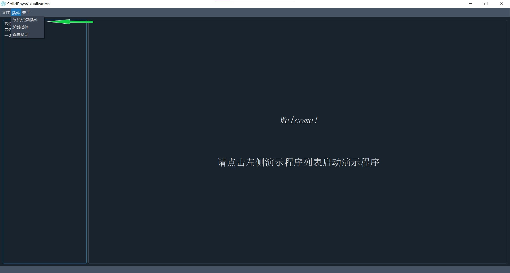

# SolidPhysVisualization
## 想法

作为一个大三的学生，做了很多次课程设计，总感觉每次大家做的题目都比较零散，更像是一个半成品。但其实如果能有某种方法将同学们做的课程设计集中起来，用同一平台来展示，这样做出的这个平台就不仅仅只是完成任务这么简单了，它可能有了更多的现实意义，也许能够反过来促进这门课的教学。

物理学的学习中，对物理问题的直观化感受是一个非常有用的学习方法。恰好此次固体物理的课程设计有很大的自由度，我就想能不能做这样的一个平台，将大家在固体物理课程设计中使用到的计算机仿真以及可视化用同一个GUI程序统一起来，这样的一个程序就不仅仅是课程设计这么简单，它甚至可以变成固体物理教学中的一个有力的工具。乃至于可以把这个平台变成一个传承性的平台，让后面学习固体物理的学弟学妹们也能参与进程序的编写中，这样既完成了课程设计，又丰富了程序中可视化的内容。

## 技术路线的选取

其实按照现在这个平台的初衷，做成web网站也许更合适，但是本人比较菜，对web开发一窍不通，而且搭网站还需要日常维护，费时费力，所以最终还是选择了Python开发桌面GUI程序的方案。至于为啥要选择Python作为开发语言，~~这还不是受铺天盖地的Python编程广告的影响（逃~~:see_no_evil: ​ ，主要是Python的库函数十分丰富，基本Numpy+matplotliab就能够胜任泥电爱而不得的~~正版~~ Matlab的基础功能了，再加上还有PyQt5这种强大的GUI库以及pyqtgraph这种完胜Matlab的可视化库，简直就是可视化程序的最佳选择。而且Python语法简单，而numpy对标的就是Matlab，语法也与Matlab相似，所以熟悉Matlab的同学能够很快的转到numpy上。最最重要的一点是numpy不会存在Matlab的版权问题。

## 程序框架

整个程序的文件构成如下：

* **main.py**是整个程序的入口，负责程序配置的读取以及GUI程序的启动。
* **src**文件夹里主要是构建GUI程序的窗口组件的配置代码以及资源文件
* **scripts**文件夹储存了用户加载加载的可视化插件程序的源文件以及帮助的资源文件



整个程序大致分为GUI和可扩展性插件程序两部分，GUI上预留了大部分的空间，用于插件可视化的展示，该部分是插件可自由绘制GUI组件的，具有极高的自由度。



## 插件程序

为了使该平台的可扩展性更强，我使用了Python的反射技术，使得其能够动态的加载以及卸载插件程序，这些选项在GUI程序的**菜单栏**—**插件**菜单中都有。

对于插件程序的编写，我提供了一个插件脚本的模板([模板](./scripts/AbstractPlugin.py))，插件的编写必须在该模板的框架下进行。在编写插件程序时，建议将插件放到单独的一个文件夹，修改插件程序脚本的文件名，但不要修改脚本代码中的类名，即所有脚本的类名都为Plugin。在GUI加载脚本文件时，程序会根据插件的文件名在`./scripts`文件夹中新建一个与插件程序脚本文件名相同的文件夹，并将与脚本文件同级的所有文件和文件夹拷贝到该文件夹中，然后根据文件名动态地加载脚本。

同时，为了脚本的易用性，程序提供了查看脚本文件的帮助信息，脚本的编写者，只需要建立一个与脚本文件同级的`help.md`文件，程序便可以直接加载到程序的插件帮助信息中。

下图是一个插件程序的典型文件结构：



## 程序使用方法

### 安装依赖

该程序目前需要安装的依赖如下：

>pyqtgraph==0.12.1
>numpy==1.20.2
>pypinyin==0.41.0
>QDarkStyle==3.0.2
>PyQt5==5.15.4

在程序根目录下使用包管理器安装上述依赖，此处以pip为例，使用的命令如下：

```powershell
pip install -r .\requirements.txt
```

### 运行主程序

在程序根目录下使用Python打开主程序：

```powershell
python .\main.py
```

### 安装与卸载插件

#### 安装插件

在程序菜单栏处，点击:arrow_right:`插件`:arrow_right:`添加/更新插件`，在弹出的文件对话框中选择需要加载的插件源文件，程序会自动在`./scripts`下建立与源文件名相同的文件夹，并将源文件以及相关文件拷贝到该文件夹中。

#### 卸载插件

在程序菜单栏处，点击:arrow_right:`插件`:arrow_right:`卸载插件`，在弹出的对话框中选择需要卸载的插件，系统会询问是否删除`./scripts`下的源文件。



### 其它

本程序以[GPLv3协议](./LICENSE)开源，欢迎大家对程序进行改进，如果觉得作者的工作有用 :raising_hand: ，希望能够点一个小小的star:star:

