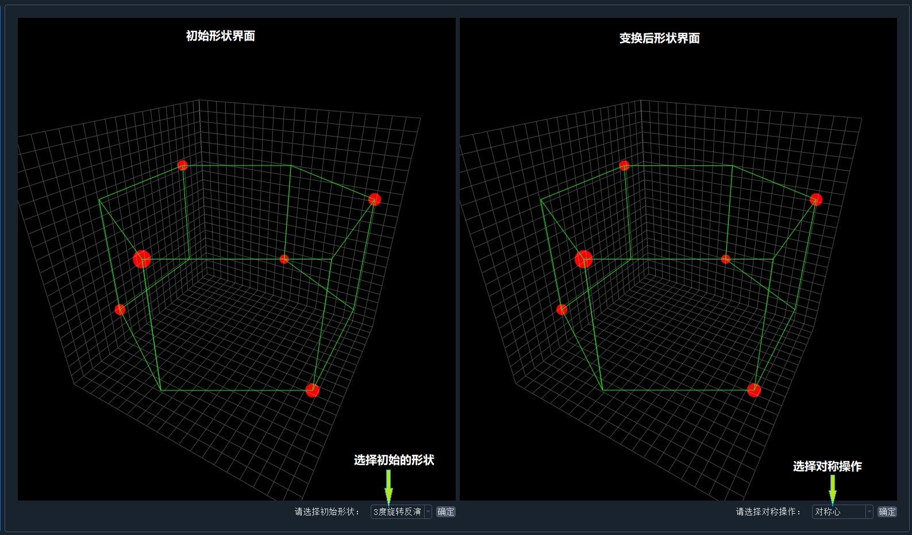

# 晶体对称性操作

## 相关知识

### 定义

一个晶体在某一变换后，晶格在空间的分布保持不变，这一变换称为对称操作。

### 正交变换

晶体经过对称变换后，晶体两点间的距离保持不变，其对应于数学中的正交变换。晶体的对称性变换主要涉及三种正交变换：**转动**、**中心反演**、**镜像**

### 基本对称操作

晶体的宏观对称操作一共有八种基本对称操作：

* 1度旋转
* 2度旋转
* 3度旋转
* 4度旋转
* 6度旋转
* 中心反演
* 镜像
* 4度旋转反演

## 关于演示程序

该程序主要用于演示对晶格的一些空间对称操作，其中包含一些非基本对称操作。其整体界面如下图：

初始形状的选项有三种：

* 3度旋转对称的基本结构
* 4度旋转对称的基本结构
* 6度旋转对称的基本结构

