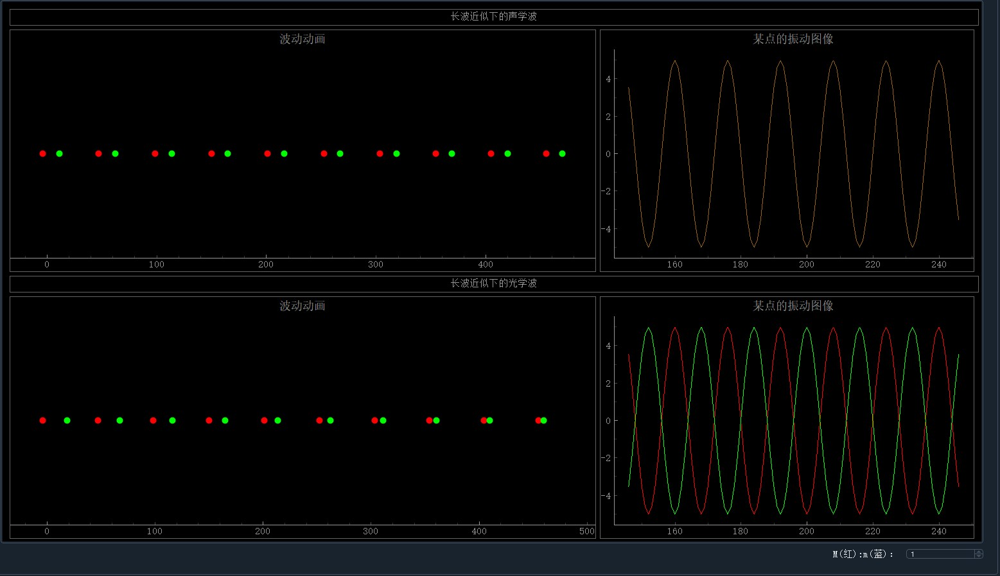

# 长波近似下的一维复式晶格振动

## 相关知识

一维复式格子的格波解可以设为如下形式：
$$
u_{2n}=A\mathrm{e}^{i(qna-\omega t)}\\
u_{2n+1}=B\mathrm{e}^{i(qna-\omega t)}
$$
其中$u_{2n}$是质量为M的原子的位移，$u_{2n+1}$是质量为m的原子的位移。

当在长波近似下，对于声学波$A=B$ ，对于光学波$\frac{A}{B}=-\frac{M}{m}$

## 程序界面

在右下角可以输入$M:m$的值，观察振动的变化情况。